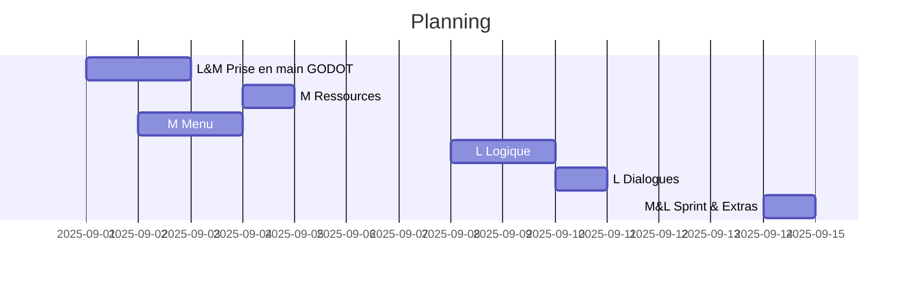

# steps: planning

---

```mermaid
gantt
    title Planning
    dateFormat  YYYY-MM-DD
    tickInterval 1day

    L&M Prise en main GODOT: jay-2, 2025-09-01, 2d
    M Ressources: resource, after menu, 1d
    M Menu: menu, 2025-09-02, 2d
    L Logique: logic, 2025-09-08, 2d
    L Dialogues: text, after logic, 1d
    M&L Sprint & Extras: 2025-09-14, 1d
```
---
